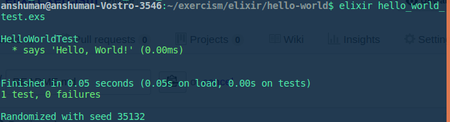
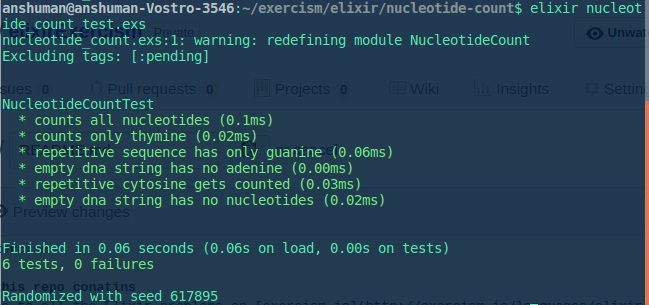
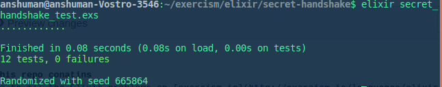

# elixirExercism

### What this repo conatins
- Solutions to all the Elixir problems on [exercism.io](http://exercism.io/languages/elixir/about) solved by [me](https://github.com/anshuman23)

* I keep adding solutions to problems here as and when I get time to solve them. Currently, I have solved the following:
  * __Hello world__:
  
   
   
  * __Nucleotide Count__:
  
  
  
  * __Secret Handshake__:
  
  
